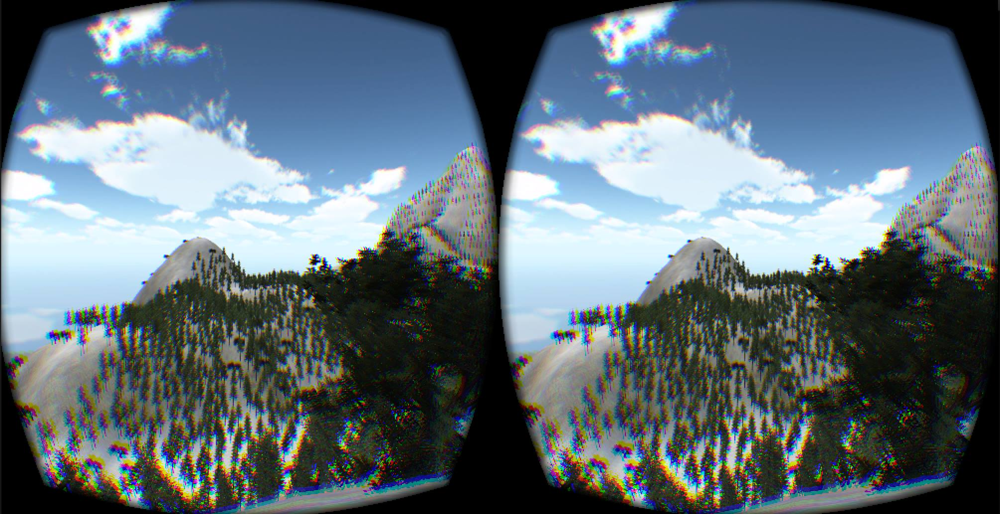
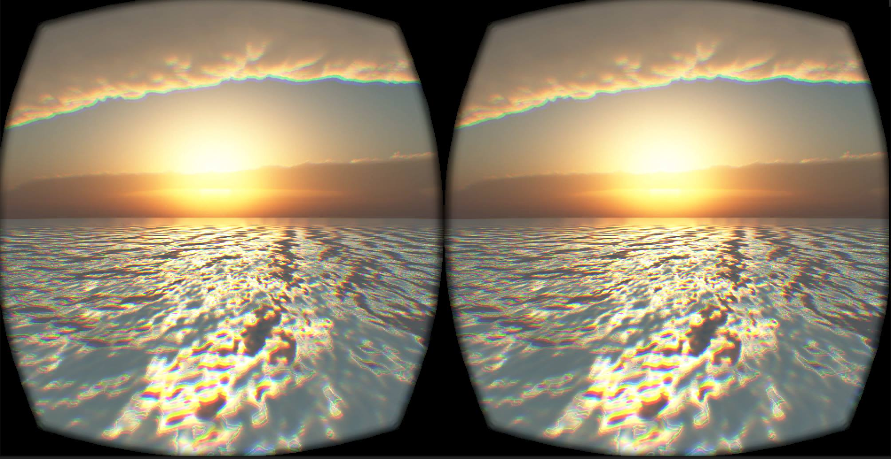
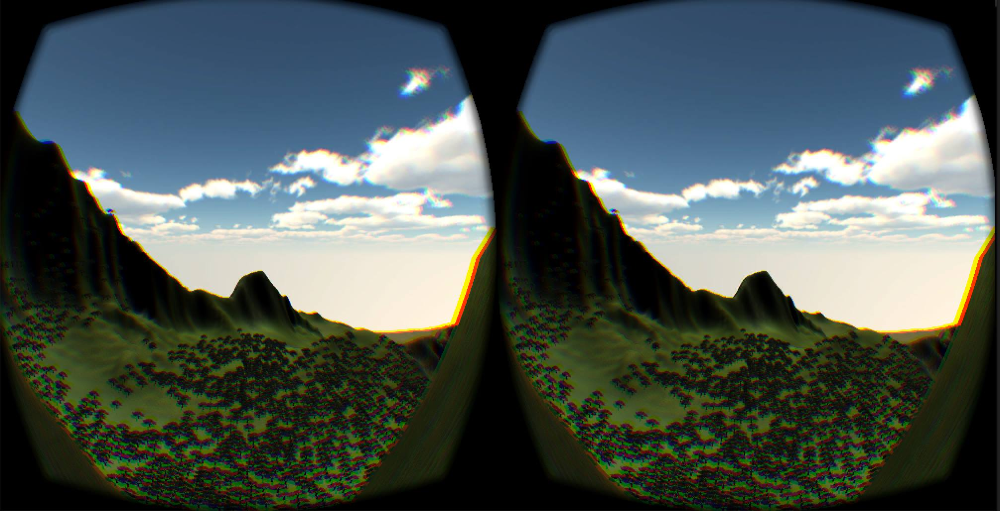
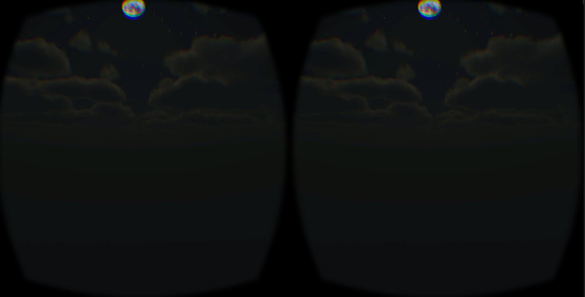

# Serenity
Serenity is a web app that presents a method for helping people cope with mental disorders, such as anxiety disorder, stress and depression.
 
 

  
The above images are custom virtual worlds we created. 
By using the oculus, or any other VR compatible with Unity, to render a virtual world for the user, they are able to calm themselves done. Then by following the step-by-step instructions on our site, they can do a self-analysis using standard questions therapists commonly ask. Your entry is then submitted to our server for you to keep a log of so you can view your progress.
 
Below, are screenshots of the webpages.
  

